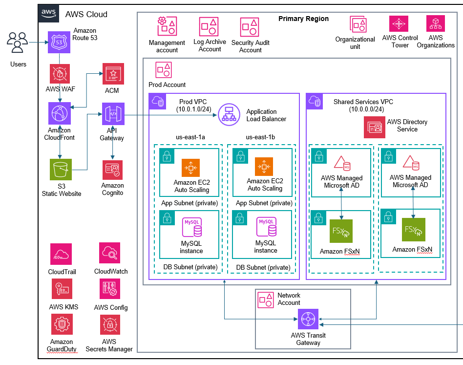

The purpose of this Terraform code is to create an equivalent environment of an On-Premise 3-Tier LAMP (Linux, Apache, MySQL, PHP ) application in the AWS Cloud (Migration Strategy of RePlatform)
Please refer to the attached Solution Design document to know more about the Architectural patterns

With the help of Terraform IaC (Infrastructure as Code) deployment, we are hereby provisioning the following AWS Cloud resources

1. One Prod VPC (10.1.0.0/16) and One Prod Shared Services VPC (10.0.0.0/16) in us-east-1 (N. Virginia)
2. Six subnets in Prod VPC (Public, Private, and Database subnets in each of the two Availability Zones) and four subnets in Shared Services VPC (Public, and Private subnets in each of the two Availability Zones)
3. Route 53 Public Hosted Zone
4. Cloudfront CDN
5. AWS Certificate Manager to create and store the TLS/SSL certificates (to be used by Cloudfront and Application Load Balancer)
6. S3 Web Hosting bucket for Static Website (user logon page)
7. AWS Application Load Balancer (to be in the public subnets of the Prod VPC), load balancer security group, Target Groups, Target Group Attachments etc.
8. AWS Transit Gateway to route traffic between the two VPCs - Prod VPC and Shared Services VPC
9. AWS Managed Microsoft AD (and corresponding Domain Controllers in the two private subnets of the Shared Services VPC)
10. FSx OnTap (FSxN) for NAS share equivalent (of on-premise), and corresponding SVMs (Storage Virtual Machines)
11. AWS SSM Parameter Store to store secrets - Active Directory Domain credentials, FSxN domain join credentials, Database credentials etc.
12. AWS KMS Keys for encrypting Data at Rest
13. EC2 instances in the Prod VPC private subnets (in us-east-1a and us-east-1b) with security groups
14. EBS volumes and volume attachments to the instances 
15. Dedicated S3 bucket to store all Access Logs